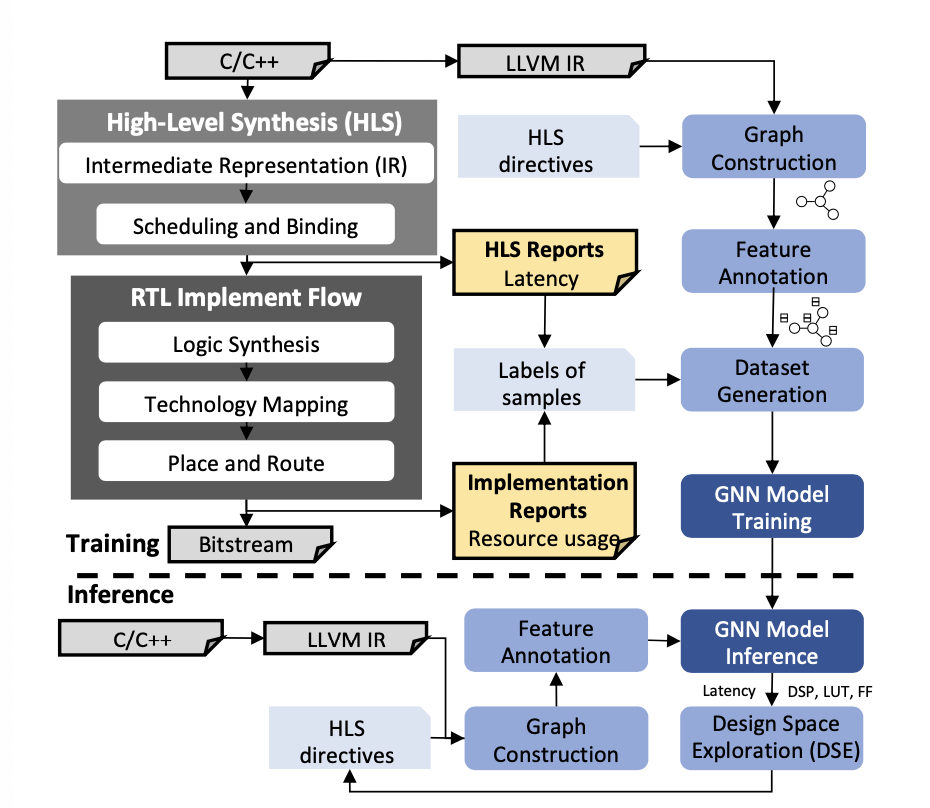

# H-GNN

## Introduction

H-GNN is a novel approach designed to enhance high-level synthesis (HLS) by providing efficient post-route quality of results (QoR) predictions. HLS significantly accelerates the hardware design process by eliminating the need for RTL programming. However, considering post-route QoR during optimization can lead to increased turnaround times. To address this challenge, we propose a hierarchical post-route QoR prediction approach specifically for FPGA HLS. Our method features:

1. **Modeling Flow**: Direct estimation of latency and post-route resource usage from C/C++ programs.
2. **Graph Construction**: An effective method that captures the control and data flow graph of source code along with the effects of HLS pragmas.
3. **Hierarchical GNN Training**: A training and prediction mechanism that effectively captures the impact of loop hierarchies.

Experimental results demonstrate that our method achieves a prediction error of less than 10% across various QoR metrics, marking a significant improvement over existing GNN methods. 
 
Our paper, "Hierarchical Source-to-Post-Route QoR Prediction in High-Level Synthesis with GNNs," is presented at DATE '24. Please refer to our paper for more details:

```bibtex
@inproceedings{h-gnn,
  author    = {Mingzhe Gao and Jieru Zhao and Zhe Lin and Minyi Guo},
  title     = {Hierarchical Source-to-Post-Route QoR Prediction in High-Level Synthesis with GNNs},
  journal   = {Design, Automation and Test in Europe Conference},
  year      = {2024},
}
```

## Overview



In the training stage, we implement the C-to-bitstream flow to derive ground-truth QoR using various HLS pragma combinations. We gather resource stats from implementation reports and latency from HLS reports. Starting with C/C++ source code, we convert it to LLVM IR and construct a graph representation with different pragma configurations. Features are extracted and annotated in the graph, leading to dataset generation. Finally, we train GNN models for accurate post-route QoR prediction, utilizing loop hierarchies. In the inference phase, predictions are made without HLS or RTL flows, enabling efficient DSE to find optimal pragma configurations for performance.


## Requirement

You can install the required packages for running this project using:

```
pip3 install --upgrade pip
pip3 install -r requirements.txt
```

This project is built on LLVM 9.0 that can be installed by:

```
wget https://apt.llvm.org/llvm.sh
chmod +x llvm.sh
sudo ./llvm.sh <version number>
```

## Project File Tree

The project file structure is as below:

```
.
├── GNNg
│   ├── data               # Dataset for GNNg
│   └── src                # Training workflow for GNNg
├── GNNnp
│   ├── data               # Dataset for GNNnp
│   └── src                # Training workflow for GNNnp
├── GNNp
│   ├── data               # Dataset for GNNp
│   └── src                # Training workflow for GNNp
├── benchmark
│   ├── auto_directive.py   # Script for automatically adding combinations of different pragmas
│   ├── kernel4graph        # Kernel code used to generate graphs
│   ├── kernel4hls          # Kernel code for extracting post-route ground truth data
│   └── run_script.py       # Script to execute benchmarking
├── requirements.txt        # List of project dependencies
└── utils
    ├── llvm-pass           # Tools for calculating iteration interval
    └── visualization        # Tools for graph visualization
```


## Build Datasets

To build the GNNp dataset, navigate to the directory and run the following commands:

```
cd GNNp/data/datasets/
python run.py
```

The generated data files (.pt) will be saved in GNNp/data/processed/pt, while the corresponding graphs for visualization will be stored in GNNp/data/processed/graph. The dataset construction for GNNnp and GNNg follows a similar process.

## Train GNN Model

To train the GNNp model, navigate to the directory and run the following commands:

```
cd GNNp/data/src/
python main.py
```

You can modify the training hyperparameters (e.g., batch size) and objectives (i.e., LUT, FF, DSP, latency) in `GNNp/data/src/config.py`. The training process and results will be saved in the `logs` folder. The model training for GNNnp and GNNg follows a similar process.